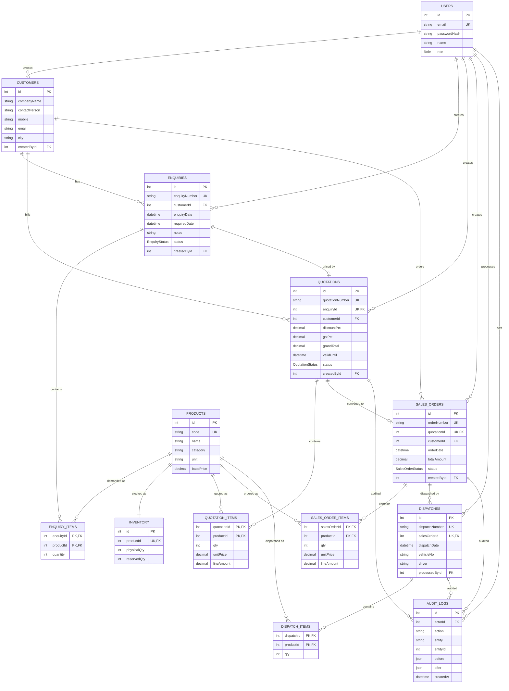

# ER Diagram — Zenitek ERP

### Key constraints

- `enquiries.enquiryNumber`, `quotations.quotationNumber`, `sales_orders.orderNumber`,
  `dispatches.dispatchNumber` — **UNIQUE**
- `quotations.enquiryId` — **UNIQUE** (one quotation per enquiry)
- `sales_orders.quotationId` — **UNIQUE** (one sales order per quotation)
- `inventory.productId` — **UNIQUE** (1:1 product inventory)
- Foreign keys `ON DELETE RESTRICT` (no orphans)
- Composite primary keys on all item tables

### Enums

- `Role`: `ADMIN | SALES_USER`
- `EnquiryStatus`: `NEW | QUOTED | WON | LOST`
- `QuotationStatus`: `DRAFT | SENT | ACCEPTED | REJECTED`
- `SalesOrderStatus`: `PENDING | CONFIRMED | DISPATCHED | CANCELLED`